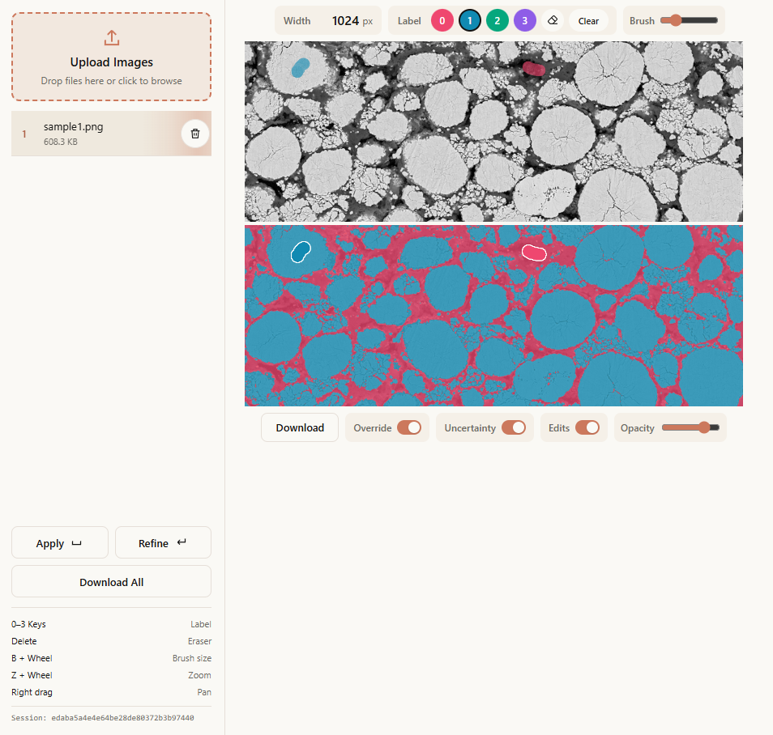

# Online Segment

Pixel-wise annotation is accurate but costly, while fully automatic segmentation can struggle with domain-specific images and limited training data. Online Segment learns from sparse brush labels, expands them into complete predictions, and highlights uncertain regions for targeted correction. The result is an efficient, self-hosted workflow for producing lossless masks at the original image dimensions while keeping data and model sessions under local control.

## Multiscale random forest

Each pixel is represented by multiscale intensity, gradient, Hessian, and Laplacian-of-Gaussian features. A random forest learns from annotated pixels only, using per-class quotas to balance labels across images and edge-guided spatial sampling to retain informative boundaries. Its class probabilities are adjusted near image edges before the most probable label is selected.

## Neural refinement

A lightweight U-Net receives image features together with the random-forest probability maps. It trains on balanced patches containing manual annotations and high-confidence prediction interiors; manual labels use full weight, while pseudo-labels use a lower weight. Rotation and reflection augmentations improve local correction from limited annotations.

The final mask is the argmax of the refined class probabilities, with pixels below the confidence threshold marked as uncertain.

The trainable annotation workflow is based on SAMBA [1] and its web implementation [2].

## Workflow

1. Upload images and choose a working width.
2. Assign project-specific meanings to labels `0–3`, then paint a few representative regions for each class.
3. Select **Apply** to train the random forest and predict the current image.
4. Optionally correct labels and select **Refine**, then export one result or the full batch.

**Label semantics.** Labels `0–3` are class identifiers, not predefined categories: label `0` does not automatically mean background. For example, a two-class project could define `0` as the surrounding matrix and `1` as the target particles; additional phases can use `2` and `3`. Use each number for the same class across every image in a session, and paint at least two distinct labels before training.

Unpainted pixels are separate from label `0` and are excluded from training. The eraser returns painted pixels to this unpainted state rather than assigning a background class. In drawn-mask exports, unpainted pixels are stored as `255`; result masks contain the predicted class values `0–3`. When **Override** is enabled, manually painted labels take precedence over the model prediction at those pixels.

The unified **Download** action saves the available result and drawn masks together in a ZIP file. Each mask is stored as a lossless indexed-palette PNG and resized to the original image dimensions with nearest-neighbor interpolation.



## Install

```bash
cd backend
pip install -r requirements.txt
```

Install PyTorch separately for your CPU or CUDA environment.

```bash
cd frontend
npm install
```

## Run

```bash
cd frontend
npm run build
```

```bash
cd backend
uvicorn app.main:app --host 0.0.0.0 --port 8000 --workers 1
```

Each page uses an isolated process-local model session, so the server must run with one worker. Session files are stored in the operating system's temporary directory and removed after one hour of inactivity or server shutdown.

## References

1. Docherty, R., Squires, I., Vamvakeros, A., & Cooper, S. J. (2024). “[SAMBA: A Trainable Segmentation Web-App with Smart Labelling](https://doi.org/10.21105/joss.06159).” *Journal of Open Source Software, 9*(98), 6159.
2. tldr-group. (n.d.). *[SAMBA Web](https://github.com/tldr-group/samba-web)* [Source code]. GitHub.
